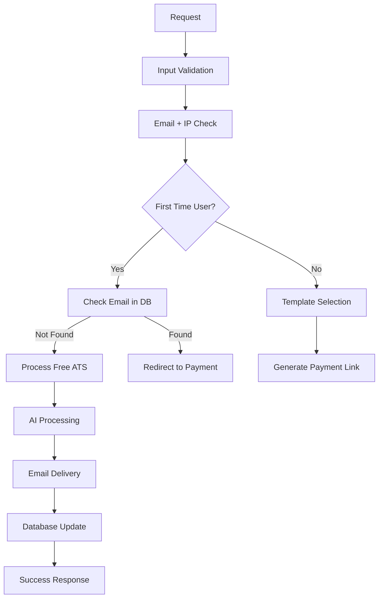

# ResumeSniper N8N → Hardcode Migration Specification
**Version**: 1.0  
**Author**: Power User Development Team  
**Date**: 2025-01-23  
**Target**: Production-ready serverless architecture  

## Executive Summary

### Founder Story & Mission
**ResumeSniper** is built by a Navy veteran with multiple degrees who experienced ATS discrimination firsthand - delivering groceries for $4/hour despite engineering qualifications. This tool represents both a business opportunity and a mission to help qualified candidates get past broken hiring systems.

**Core Philosophy**: "If you can count to four, this app will be easy to use"

### Business Objective
Migrate from N8N visual workflow to hardcoded serverless architecture to achieve:
- **95%+ profit margins** through template differentiation strategy
- **<30 second processing** for competitive advantage  
- **Complete operational control** with local development workflow
- **Professional infrastructure** capable of $300/day revenue target
- **Authentic brand positioning** with military-style transparency

### Technical Transformation
```
FROM: Frontend → N8N Cloud → Multiple visual nodes → APIs
TO:   Frontend → Vercel Functions → Direct API calls → Response
```

### Revenue Model & Brand Strategy
```
Template Pricing (Trojan Horse Strategy):
- ATS Optimized: FREE (first-time users only) 
- Entry Clean: $5.99
- Tech Focus: $7.99
- Professional Plus: $8.99  
- Executive Format: $9.99

Cost per resume: ~$0.80 (AI + infrastructure)
Profit margin: 85-92% per transaction
```

**Brand Voice**: Authentic military-style communication, no corporate BS
- "Skip fake 5-star reviews - try one free and see for yourself"
- Transparent about AI limitations and pricing
- Personal founder story drives authenticity

---

## Architecture Overview

### Infrastructure Stack
```yaml
Domain: resumevita.com (6 years, Cloudflare)
Frontend: Vercel (React SPA)
Backend: Vercel Serverless Functions
Database: Supabase PostgreSQL
CDN: Cloudflare (global edge caching)
Email: Resend API (professional delivery)
Payments: Stripe API (tiered pricing)
AI: Anthropic Claude 3.5 Sonnet
```

### Service Dependencies
```json
{
  "required_apis": {
    "anthropic": "claude-3-5-sonnet-20241022",
    "supabase": "postgresql + auth + storage",
    "stripe": "payment processing + webhooks",
    "resend": "transactional email delivery"
  },
  "optional_apis": {
    "vercel_analytics": "usage tracking",
    "sentry": "error monitoring"
  }
}
```

---

## API Endpoint Specifications

### Primary Endpoint: `/api/process-resume`
```typescript
interface ProcessResumeRequest {
  email: string;
  resumeContent: string;
  jobDescription: string;
  fileName: string;
  template: 'ats-optimized' | 'entry-clean' | 'tech-focus' | 'professional' | 'executive';
  isFirstTimeFlow: boolean;
}

interface ProcessResumeResponse {
  success: boolean;
  message: string;
  processing_time?: number;
  requires_payment?: boolean;
  payment_url?: string;
  error_code?: string;
}
```

### Business Logic Flow


### Payment Webhook: `/api/stripe-webhook`
```typescript
interface StripeWebhookPayload {
  type: 'checkout.session.completed' | 'payment_intent.payment_failed';
  data: {
    object: {
      customer_details: { email: string };
      metadata: { template: string; resume_content: string; job_description: string };
      amount_total: number;
    }
  }
}
```

---

## User Experience Strategy

### Two-Button Flow (Simplified Email-Based Detection)
```
┌─────────────────┐  ┌─────────────────┐
│   🆓 First Time │  │  ⭐ Returning   │
│     Here?       │  │      User?      │
│ Test the tool - │  │   Choose premium│
│   FREE resume   │  │    templates    │
└─────────────────┘  └─────────────────┘
```

**Business Logic:**
- **First Time Flow**: Check email in database → If not found, process FREE ATS template
- **Returning User Flow**: Always redirect to paid template selection
- **No complex frontend logic**: N8N handles all pricing decisions

### Template Selection (1x5 Layout)
```
[FREE Trial] → [Entry $5.99] → [Tech $7.99] → [Pro $8.99] → [Exec $9.99]
ATS Optimized   Modern Clean    IT Focus     Career Growth  Senior Roles
```

**Template Differentiation Psychology:**
- Same AI optimization + different CSS = perceived premium value
- Customers pay for "specialization" while costs remain identical
- 95%+ profit margin on template "upgrades"

### User Journey
1. **First Visit**: Select "First Time" → Get FREE ATS resume → Email captured
2. **Return Visit**: Select "Returning User" → Choose premium template → Pay → Receive
3. **Future Visits**: Repeat with different templates for different applications

---

## Database Schema Updates

### Users Table (Existing - Enhanced)
```sql
ALTER TABLE users ADD COLUMN IF NOT EXISTS last_ip INET;
ALTER TABLE users ADD COLUMN IF NOT EXISTS user_agent TEXT;
ALTER TABLE users ADD COLUMN IF NOT EXISTS template_preferences JSONB;
```

### Bad Emails Table (New)
```sql
CREATE TABLE bad_emails (
  id SERIAL PRIMARY KEY,
  email VARCHAR(255) NOT NULL,
  attempt_count INTEGER DEFAULT 1,
  ip_addresses INET[] DEFAULT '{}',
  first_seen TIMESTAMP DEFAULT NOW(),
  last_seen TIMESTAMP DEFAULT NOW(),
  status VARCHAR(20) DEFAULT 'monitoring',
  notes TEXT
);

CREATE INDEX idx_bad_emails_email ON bad_emails(email);
CREATE INDEX idx_bad_emails_status ON bad_emails(status);
```

### IP Tracking Table (New)
```sql
CREATE TABLE ip_tracking (
  id SERIAL PRIMARY KEY,
  ip_address INET NOT NULL,
  email_count INTEGER DEFAULT 1,
  last_email VARCHAR(255),
  first_seen TIMESTAMP DEFAULT NOW(),
  last_seen TIMESTAMP DEFAULT NOW(),
  country_code VARCHAR(2),
  status VARCHAR(20) DEFAULT 'normal'
);

CREATE INDEX idx_ip_tracking_ip ON ip_tracking(ip_address);
```

### Chargeback Blacklist (New)
```sql
CREATE TABLE chargeback_blacklist (
  id SERIAL PRIMARY KEY,
  email VARCHAR(255) NOT NULL,
  ip_address INET,
  stripe_payment_id VARCHAR(255),
  chargeback_date TIMESTAMP DEFAULT NOW(),
  amount_cents INTEGER,
  permanent_ban BOOLEAN DEFAULT true,
  notes TEXT
);
```

---

## Fraud Detection Implementation

### Email + IP Validation Logic
```javascript
async function validateUserAccess(email, ip, isFirstTime) {
  // Check email existence
  const existingUser = await supabase
    .from('users')
    .select('email, resumes_used, last_ip')
    .eq('email', email)
    .single();

  // First-time flow validation
  if (isFirstTime) {
    if (existingUser.data) {
      return {
        authorized: false,
        reason: 'email_previously_used',
        action: 'redirect_to_payment'
      };
    }
  }

  // Check bad emails
  const badEmail = await supabase
    .from('bad_emails')
    .select('attempt_count, status')
    .eq('email', email)
    .single();

  if (badEmail.data && badEmail.data.attempt_count >= 5) {
    return {
      authorized: false,
      reason: 'email_permanently_blocked',
      action: 'block_request'
    };
  }

  // IP validation
  const ipCheck = await supabase
    .from('ip_tracking')
    .select('email_count, status')
    .eq('ip_address', ip)
    .single();

  if (ipCheck.data && ipCheck.data.email_count > 10) {
    return {
      authorized: false,
      reason: 'ip_suspicious_activity',
      action: 'manual_review'
    };
  }

  return { authorized: true };
}
```

### Bad Email Escalation
```javascript
async function handleBadEmail(email, ip) {
  const { data, error } = await supabase
    .from('bad_emails')
    .upsert({
      email: email,
      attempt_count: supabase.raw('attempt_count + 1'),
      ip_addresses: supabase.raw('array_append(ip_addresses, $1)', [ip]),
      last_seen: new Date().toISOString()
    }, {
      onConflict: 'email'
    });

  // Check if threshold reached
  if (data.attempt_count >= 5) {
    await blockEmailPermanently(email, ip);
    await sendAdminAlert('email_blocked', { email, ip, attempts: data.attempt_count });
  }
}
```

---

## Fraud Detection & Business Rules

### What Actually Matters (Revenue-Focused)
```javascript
const businessRules = {
  // Protect free tier from abuse
  free_tier_abuse: {
    trigger: "email_already_used",
    action: "redirect_to_paid_templates"
  },
  
  // Protect against payment fraud
  payment_fraud: {
    trigger: "failed_payments > 3",
    action: "block_payment_attempts"
  },
  
  // Zero tolerance for chargebacks
  chargeback_policy: {
    trigger: "chargeback_detected", 
    action: "permanent_ban_email_and_ip"
  },
  
  // Cost protection (Anthropic bills)
  resource_abuse: {
    trigger: "resume_file_size > 50KB",
    action: "reject_with_size_limit_message"
  }
};
```

### What DOESN'T Matter (Revenue-Positive)
```javascript
const ignoredPatterns = {
  high_volume_if_paying: "Bot doing 600 resumes/hour paying $7 each = $4,200/hour revenue",
  legitimate_businesses: "Career coaches helping multiple clients",
  testing_researchers: "Academic research on ATS systems"
};
```

### Email + IP Validation Strategy
- **Redundancy for evasion detection**: Same email, different IP = legitimate user on different device
- **Bad email escalation**: 5 invalid attempts = permanent block
- **Cost**: Negligible storage, massive fraud prevention value

---

## Template System Architecture

### HTML Template Structure
```
/templates/
├── ats-optimized.html      (FREE tier)
├── entry-clean.html        ($5.99)
├── tech-focus.html         ($7.99)
├── professional-plus.html  ($8.99)
└── executive-format.html   ($9.99)
```

### Template Variable System
```javascript
const templateVariables = {
  // Personal Information
  '{{FULL_NAME}}': data.personalInfo.name,
  '{{EMAIL}}': data.personalInfo.email,
  '{{PHONE}}': data.personalInfo.phone,
  '{{LOCATION}}': data.personalInfo.location,
  '{{LINKEDIN}}': data.personalInfo.linkedin,
  
  // Content Sections
  '{{SUMMARY}}': data.processedContent.summary,
  '{{EXPERIENCE}}': data.processedContent.experience,
  '{{EDUCATION}}': data.processedContent.education,
  '{{SKILLS}}': data.processedContent.skills,
  '{{CERTIFICATIONS}}': data.processedContent.certifications,
  
  // Template-Specific
  '{{EXECUTIVE_TITLE}}': data.executiveInfo?.title,
  '{{LEADERSHIP_HIGHLIGHTS}}': data.executiveInfo?.highlights,
  '{{PROJECTS}}': data.technicalInfo?.projects
};
```

### Template Processing Pipeline
```javascript
async function processTemplate(templateId, resumeData) {
  // Load template
  const templatePath = `./templates/${templateId}.html`;
  let template = await fs.readFile(templatePath, 'utf8');
  
  // Replace variables
  Object.entries(templateVariables).forEach(([placeholder, value]) => {
    template = template.replace(new RegExp(placeholder, 'g'), value || '');
  });
  
  // Process conditional sections
  template = processConditionalSections(template, resumeData);
  
  return template;
}
```

---

## Frontend Component Specifications

### Template Selection Component (1x5 Layout)
```jsx
const TemplateSelector = ({ selectedTemplate, onTemplateChange, isFirstTime }) => {
  const templates = [
    { 
      id: 'ats-optimized', 
      name: 'ATS Optimized', 
      price: 5.99, 
      freeForFirstTime: true,
      description: 'Traditional structure, works for any industry',
      icon: '⭐'
    },
    { 
      id: 'entry-clean', 
      name: 'Entry Clean', 
      price: 5.99,
      description: 'Modern design for entry-level professionals',
      icon: '✨'
    },
    { 
      id: 'tech-focus', 
      name: 'Tech Focus', 
      price: 7.99,
      description: 'Optimized for IT and engineering roles',
      icon: '⚙️'
    },
    { 
      id: 'professional-plus', 
      name: 'Professional Plus', 
      price: 8.99,
      description: 'Enhanced formatting for career growth',
      icon: '👁️'
    },
    { 
      id: 'executive-format', 
      name: 'Executive Format', 
      price: 9.99,
      description: 'Premium design for senior leadership',
      icon: '💼'
    }
  ];

  return (
    <div className="template-selector">
      <h2>Choose Your Resume Template</h2>
      {isFirstTime && (
        <p className="free-trial-notice">
          New users: Try our ATS Optimized template FREE!
        </p>
      )}
      
      <div className="template-grid-1x5">
        {templates.map(template => (
          <TemplateCard 
            key={template.id}
            template={template}
            isSelected={selectedTemplate === template.id}
            isFirstTime={isFirstTime}
            onClick={() => onTemplateChange(template.id)}
          />
        ))}
      </div>
    </div>
  );
};
```

### User Flow Component
```jsx
const UserFlowSelector = ({ isFirstTime, setIsFirstTime }) => (
  <div className="user-flow-selector">
    <div className="flow-buttons">
      <button 
        className={`flow-button ${isFirstTime ? 'active' : ''}`}
        onClick={() => setIsFirstTime(true)}
      >
        <div className="flow-icon">🆓</div>
        <div className="flow-title">First Time Here?</div>
        <div className="flow-subtitle">Test the tool - FREE resume</div>
      </button>
      
      <button 
        className={`flow-button ${!isFirstTime ? 'active' : ''}`}
        onClick={() => setIsFirstTime(false)}
      >
        <div className="flow-icon">⭐</div>
        <div className="flow-title">Returning User?</div>
        <div className="flow-subtitle">Choose premium templates</div>
      </button>
    </div>
  </div>
);
```

---

## AI Processing Implementation

### Claude API Integration
```javascript
async function processResumeWithClaude(resumeContent, jobDescription, templateType) {
  const prompt = `You are a master resume writer specializing in ATS optimization.

TEMPLATE TYPE: ${templateType}
TARGET: ${getTemplateTarget(templateType)}

INSTRUCTIONS:
- Do NOT lie or over-embellish
- Create an ATS-optimized resume that matches the job requirements
- Use keywords from the job description naturally
- Maintain professional formatting appropriate for ${templateType}
- Keep the same contact information
- Focus on relevant experience for this specific job
- Format output for ${templateType} template structure

ORIGINAL RESUME:
${resumeContent}

JOB DESCRIPTION:
${jobDescription}

Return a structured resume optimized for ATS systems and formatted for the ${templateType} template:`;

  const response = await anthropic.messages.create({
    model: "claude-3-5-sonnet-20241022",
    max_tokens: 4000,
    messages: [{ role: "user", content: prompt }]
  });

  return response.content[0].text;
}

function getTemplateTarget(templateType) {
  const targets = {
    'ats-optimized': 'general ATS compliance and broad industry appeal',
    'entry-clean': 'entry-level positions with clean, modern presentation',
    'tech-focus': 'technical roles with emphasis on skills and projects',
    'professional-plus': 'career advancement with enhanced formatting',
    'executive-format': 'senior leadership roles with executive presence'
  };
  return targets[templateType] || targets['ats-optimized'];
}
```

---

## Stripe Payment Integration (Finalized Strategy)

### Product Configuration
```javascript
const STRIPE_PRODUCTS = {
  'entry-clean': {
    price_id: 'price_1ObJUt2eZvKYlo2CaP4yGX8K',
    amount: 599, // $5.99
    name: 'Modern Clean Template'
  },
  'tech-focus': {
    price_id: 'price_1ObJV12eZvKYlo2CbQ5rYH9L', 
    amount: 799, // $7.99
    name: 'Technical Focus Template'
  },
  'professional-plus': {
    price_id: 'price_1ObJV52eZvKYlo2CcR6sZI0M',
    amount: 899, // $8.99
    name: 'Professional Plus Template'
  },
  'executive-format': {
    price_id: 'price_1ObJV92eZvKYlo2CdS7tAJ1N',
    amount: 999, // $9.99
    name: 'Executive Format Template'
  }
};
```

### Revenue Tracking by Template
```javascript
// Template usage analytics for business intelligence
const revenueAnalytics = {
  track_by_tier: {
    entry: { price: 5.99, target_market: 'recent_grads' },
    professional: { price: 7.99, target_market: 'tech_workers' },
    premium: { price: 8.99, target_market: 'career_changers' },
    executive: { price: 9.99, target_market: 'senior_leadership' }
  },
  
  // Expected distribution based on market psychology
  projected_usage: {
    entry: '25%',      // Price-conscious users
    professional: '35%', // Largest tech market
    premium: '25%',     // Career advancement seekers  
    executive: '15%'    // Smallest but highest-value segment
  }
};
```

---

## Payment Integration

### Stripe Payment Link Generation
```javascript
const STRIPE_PRICE_IDS = {
  'entry-clean': 'price_1ObJUt2eZvKYlo2CaP4yGX8K',
  'tech-focus': 'price_1ObJV12eZvKYlo2CbQ5rYH9L',
  'professional-plus': 'price_1ObJV52eZvKYlo2CcR6sZI0M',
  'executive-format': 'price_1ObJV92eZvKYlo2CdS7tAJ1N'
};

async function createPaymentSession(template, email, resumeData) {
  const session = await stripe.checkout.sessions.create({
    mode: 'payment',
    payment_method_types: ['card'],
    line_items: [{
      price: STRIPE_PRICE_IDS[template],
      quantity: 1,
    }],
    customer_email: email,
    metadata: {
      template: template,
      resume_content: Buffer.from(resumeData.resumeContent).toString('base64'),
      job_description: Buffer.from(resumeData.jobDescription).toString('base64'),
      file_name: resumeData.fileName
    },
    success_url: `${process.env.NEXT_PUBLIC_URL}/payment-success?session_id={CHECKOUT_SESSION_ID}`,
    cancel_url: `${process.env.NEXT_PUBLIC_URL}?cancelled=true`
  });

  return session.url;
}
```

### Webhook Processing
```javascript
export default async function handler(req, res) {
  if (req.method !== 'POST') return res.status(405).end();

  const sig = req.headers['stripe-signature'];
  let event;

  try {
    event = stripe.webhooks.constructEvent(req.body, sig, process.env.STRIPE_WEBHOOK_SECRET);
  } catch (err) {
    return res.status(400).send(`Webhook signature verification failed.`);
  }

  if (event.type === 'checkout.session.completed') {
    const session = event.data.object;
    
    // Decode resume data from metadata
    const resumeData = {
      resumeContent: Buffer.from(session.metadata.resume_content, 'base64').toString(),
      jobDescription: Buffer.from(session.metadata.job_description, 'base64').toString(),
      fileName: session.metadata.file_name,
      template: session.metadata.template
    };

    // Process the paid resume
    await processResumeAfterPayment(session.customer_email, resumeData);
  }

  res.status(200).json({ received: true });
}
```

---

## Error Handling & Monitoring

### Error Response Standards
```typescript
interface ErrorResponse {
  success: false;
  error_code: string;
  message: string;
  details?: any;
  timestamp: string;
  request_id: string;
}

const ERROR_CODES = {
  VALIDATION_FAILED: 'Invalid input data',
  EMAIL_BLOCKED: 'Email address is not authorized',
  PAYMENT_REQUIRED: 'Payment required for premium templates',
  AI_PROCESSING_FAILED: 'Resume optimization failed',
  RATE_LIMITED: 'Too many requests',
  SYSTEM_ERROR: 'Internal system error'
};
```

### Logging Strategy
```javascript
const logger = {
  info: (message, data) => console.log(JSON.stringify({ level: 'info', message, data, timestamp: new Date().toISOString() })),
  error: (message, error, data) => console.error(JSON.stringify({ level: 'error', message, error: error.message, stack: error.stack, data, timestamp: new Date().toISOString() })),
  warn: (message, data) => console.warn(JSON.stringify({ level: 'warn', message, data, timestamp: new Date().toISOString() }))
};
```

---

## Deployment Configuration

### Environment Variables
```bash
# Anthropic AI
ANTHROPIC_API_KEY=sk-ant-...

# Supabase
NEXT_PUBLIC_SUPABASE_URL=https://xxx.supabase.co
SUPABASE_SERVICE_ROLE_KEY=eyJhbGciOiJIUzI1NiIsInR5cCI6IkpXVCJ9...

# Stripe
STRIPE_SECRET_KEY=sk_live_...
STRIPE_WEBHOOK_SECRET=whsec_...
NEXT_PUBLIC_STRIPE_PUBLISHABLE_KEY=pk_live_...

# Email
RESEND_API_KEY=re_...
FROM_EMAIL=admin@resumevita.com

# Application
NEXT_PUBLIC_URL=https://resumevita.com
NODE_ENV=production
```

### Vercel Configuration (`vercel.json`)
```json
{
  "functions": {
    "pages/api/process-resume.js": {
      "maxDuration": 60
    },
    "pages/api/stripe-webhook.js": {
      "maxDuration": 30
    }
  },
  "headers": [
    {
      "source": "/api/(.*)",
      "headers": [
        { "key": "Access-Control-Allow-Origin", "value": "https://resumevita.com" },
        { "key": "Access-Control-Allow-Methods", "value": "POST, OPTIONS" },
        { "key": "Access-Control-Allow-Headers", "value": "Content-Type, Authorization" }
      ]
    }
  ]
}
```

---

## Performance Targets

### Response Time Requirements
```yaml
API Endpoints:
  - Email validation: <100ms
  - Payment redirect: <200ms
  - AI processing: <30s total
  - Email delivery: <5s

Frontend Performance:
  - First Contentful Paint: <1.5s
  - Largest Contentful Paint: <2.5s
  - Cumulative Layout Shift: <0.1
```

### Success Metrics
```yaml
Technical:
  - 99.9% uptime
  - <30s end-to-end processing
  - <1% error rate
  - Zero security incidents

Business:
  - 95%+ profit margin per transaction
  - <2% chargeback rate
  - >80% customer satisfaction
  - $300/day revenue target
```

---

## Testing Criteria

### Unit Tests Required
```javascript
// API endpoint testing
describe('/api/process-resume', () => {
  test('processes free resume for new user', async () => {
    const response = await processResume({
      email: 'new@test.com',
      template: 'ats-optimized',
      isFirstTimeFlow: true
    });
    expect(response.success).toBe(true);
  });

  test('redirects to payment for returning user', async () => {
    const response = await processResume({
      email: 'existing@test.com',
      template: 'executive-format',
      isFirstTimeFlow: false
    });
    expect(response.requires_payment).toBe(true);
  });
});
```

### Integration Tests
```javascript
// End-to-end workflow testing
describe('Complete user journey', () => {
  test('first-time user gets free resume', async () => {
    // Submit form → Process resume → Send email → Update database
  });

  test('returning user payment flow', async () => {
    // Submit form → Redirect to Stripe → Webhook processes → Send resume
  });
});
```

---

## Security Implementation

### Input Validation
```javascript
const resumeSchema = {
  email: { type: 'string', format: 'email', required: true },
  resumeContent: { type: 'string', minLength: 100, maxLength: 50000, required: true },
  jobDescription: { type: 'string', minLength: 50, maxLength: 20000, required: true },
  fileName: { type: 'string', maxLength: 255, required: true },
  template: { type: 'string', enum: ['ats-optimized', 'entry-clean', 'tech-focus', 'professional-plus', 'executive-format'], required: true }
};
```

### Rate Limiting
```javascript
const rateLimiter = {
  windowMs: 15 * 60 * 1000, // 15 minutes
  max: 5, // limit each IP to 5 requests per windowMs
  message: 'Too many resume submissions, please try again later.',
  standardHeaders: true,
  legacyHeaders: false
};
```

---

## Migration Checklist

### Pre-Migration
- [ ] Domain purchased and configured
- [ ] Vercel project created and deployed
- [ ] All environment variables configured
- [ ] Database schema updated
- [ ] Template files created and tested

### Migration Day
- [ ] DNS records updated to point to Vercel
- [ ] N8N workflow disabled (kept as backup)
- [ ] Monitoring enabled
- [ ] Error tracking configured
- [ ] Test transactions completed

### Post-Migration
- [ ] Performance monitoring for 48 hours
- [ ] Customer satisfaction survey sent
- [ ] Revenue tracking validated
- [ ] Error rates within acceptable limits
- [ ] N8N infrastructure can be decommissioned

---

## Implementation Sessions

### Session 1: Core API Development
**Deliverables:**
- `/api/process-resume.js` - Main processing endpoint
- `/api/stripe-webhook.js` - Payment webhook handler
- Database schema updates
- Basic fraud detection logic

### Session 2: Frontend Integration
**Deliverables:**
- Updated React components for 1x5 template layout
- User flow selector (first-time vs returning)
- Template selection with pricing display
- Form submission integration

### Session 3: Template System
**Deliverables:**
- 5 HTML resume templates
- Template processing pipeline
- Variable replacement system
- PDF generation setup (optional)

### Session 4: Testing & Polish
**Deliverables:**
- Comprehensive error handling
- Performance optimization
- Security hardening
- Production deployment

---

## Power User Commands

When resuming development, use these commands:

**Start Session**: `"Implement Session [N] from the ResumeSniper spec - build all deliverables autonomously"`

**Check Progress**: `"Recap progress on ResumeSniper migration - what's complete and what's next"`

**Debug Issues**: `"Fix the [specific issue] in ResumeSniper based on spec requirements"`

**Deploy**: `"Deploy ResumeSniper to production with all security and monitoring configured"`

---

**END OF SPECIFICATION**

*This spec enables autonomous development with complete context preservation and minimal token overhead for session continuation.*